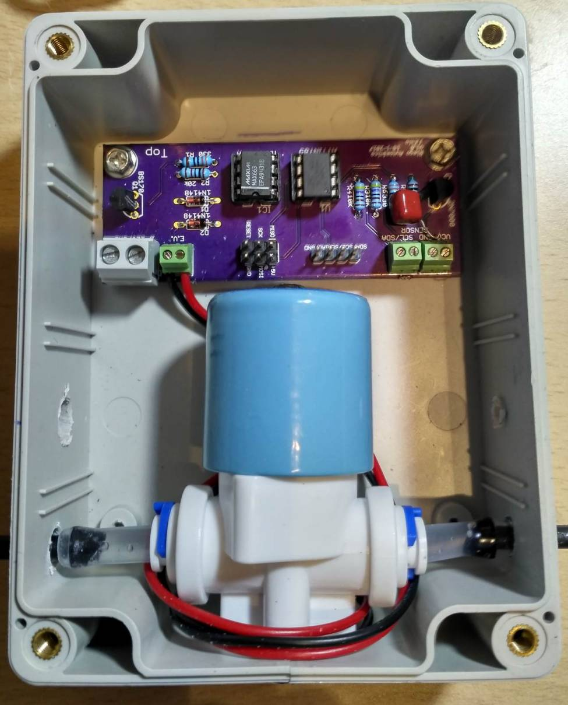
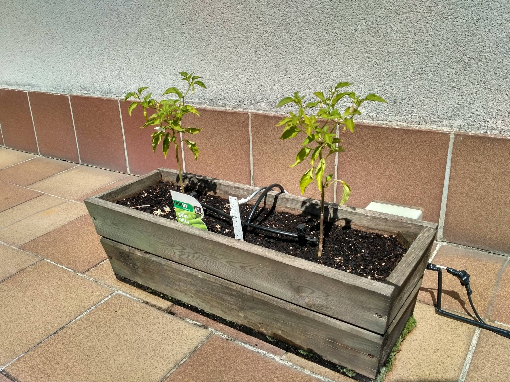

View this project on [CADLAB.io](https://cadlab.io/node/1000). 

# Watering-System
Watering system with Attiny85 and i2c moisture sensor.

**FEATURES:**

 - Measures soil moisture, light and temperature.
 - It waters only at night.
 - It doesn't water if temperature is below 4ºC.
 - It waters depending on a preset value and a hysteresis.

 - It takes measurements every hour, then microcontroller goes to deep sleep.
 - If it irrigates, then checks moisture again after five minutes.

**BILL OF MATERIALS:**

 - Valve: https://www.aliexpress.com/item/Free-shipping-Plastic-solenoid-valve-12VDC-for-drink-water-air-6-35mm-1-4-Quick-plug/1411672083.html?spm=2114.13010608.0.0.Ew7MCd
 
 - I2C Soil moisture sensor: https://www.tindie.com/products/miceuz/i2c-soil-moisture-sensor/?pt=full_prod_search
 
 - Enclosure: https://www.aliexpress.com/item/New-1-PC-Waterproof-115x90x55MM-Cover-Plastic-Electronic-Project-Box-Enclosure-Case-VE837-P0-3/32701644399.html?spm=2114.13010608.0.0.FBugqX
 
 - Attiny85
 - MAX663CPA
 - 2N7000
 - BS170

**PICTURES:**

 

